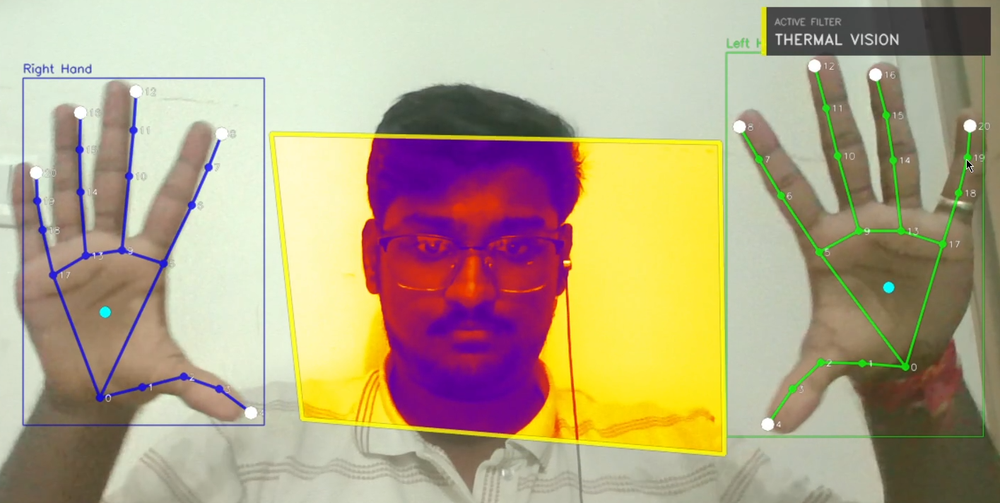
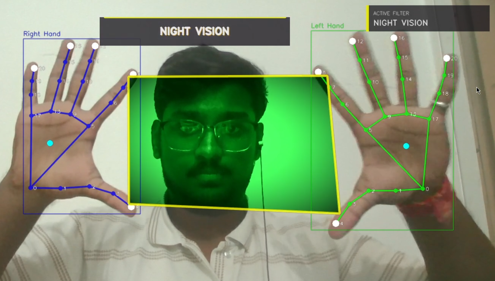
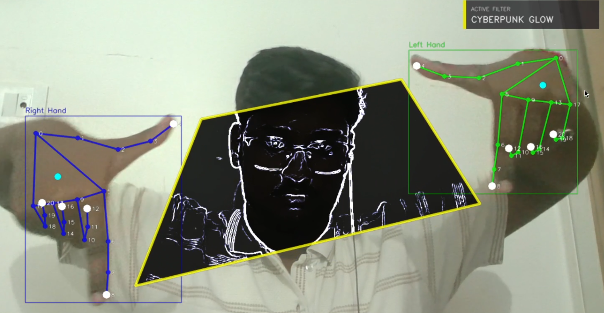
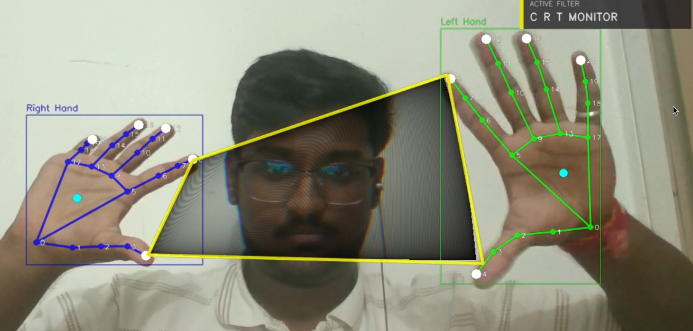

<div align="center">

# 🖐️ DesignTouch

### Interactive Finger-Controlled Reality Filters using Computer Vision & GLSL Shaders

An experimental computer vision installation that transforms your hands into dynamic, perspective-corrected reality filter panels using **MediaPipe**, **OpenCV**, **ModernGL**, and **GLSL**.


---

> **Replace the image below with your own GIF or screenshot**

<p align="center">

</p>

</div>

---

# ✨ Overview

**DesignTouch** is a real-time interactive installation that converts your fingers into floating reality filter panels.

Using **MediaPipe Hands**, the system tracks both hands in real time, generates perspective-corrected panels between fingertips, and applies GPU-accelerated visual effects through custom GLSL fragment shaders.

The project combines:

- 👋 Computer Vision
- 🎨 GPU Graphics Programming
- ✨ Real-Time Visual Effects
- 🤖 Gesture Recognition
- 📐 Perspective Transformations
- 🎭 Interactive Digital Installations

---

# 🎥 Demo

Replace this with your project demo.

```
assets/
 ├── demo.gif
 └── screenshots/
```

or

```
https://youtu.be/your-video
```

---

# 🚀 Features

## 👋 Real-Time Hand Tracking

- Dual hand tracking
- 21 landmarks per hand
- Real-time webcam processing
- EMA landmark smoothing
- Occlusion handling

---

## 🎨 Dynamic Reality Panels

Creates perspective-corrected floating panels between matching fingertips.

Features include:

- Homography transformation
- Perspective correction
- Dynamic resizing
- Persistent floating panels
- Smooth animations

---

## ⚡ GPU Accelerated Rendering

Powered by **ModernGL** and custom GLSL shaders.

### Available Filters

- 🔥 Thermal Vision
- 📼 VHS Glitch
- ⚫ Halftone
- 💎 Glass Refraction

---

## ✋ Gesture Recognition

| Gesture      | Action                      |
| ------------ | --------------------------- |
| 🤏 Pinch     | Spawn floating filter panel |
| 👋 Swipe     | Switch shader               |
| ✊ Fist      | Freeze frame                |
| 🖐 Open Palm | Clear all panels            |

---

## 🔗 TouchDesigner Integration

Streams real-time OSC data including:

- Hand landmarks
- Panel coordinates
- Gesture states
- Active shader
- Tracking confidence

Perfect for interactive installations and live performances.

---

## 🖥 CPU Fallback

If OpenGL is unavailable, DesignTouch automatically switches to a CPU-based rendering pipeline using OpenCV and NumPy.

---

# 🛠 Tech Stack

| Category          | Technology |
| ----------------- | ---------- |
| Language          | Python     |
| Computer Vision   | OpenCV     |
| Hand Tracking     | MediaPipe  |
| GPU Rendering     | ModernGL   |
| Graphics          | OpenGL     |
| Shaders           | GLSL       |
| Window            | Pygame     |
| Mathematics       | NumPy      |
| OSC Communication | python-osc |

---

# 📂 Project Structure

```text
DesignTouch/
│
├── assets/
│   ├── demo.gif
│   └── screenshots/
│
├── shaders/
│   ├── thermal.frag
│   ├── vhs.frag
│   ├── halftone.frag
│   └── glass.frag
│
├── src/
│
├── requirements.txt
├── main.py
└── README.md
```

---

# ⚙ Installation

## Clone Repository

```bash
git clone https://github.com/Guruprasad-Bhosale/DesignTouch.git
```

Move into the project

```bash
cd DesignTouch
```

Install dependencies

```bash
pip install -r requirements.txt
```

---

# ▶ Running

### GPU Mode

```bash
python main.py
```

### CPU Mode

```bash
python main.py --cpu
```

---

# ⚙ Command Line Options

| Option       | Description         |
| ------------ | ------------------- |
| `--camera`   | Camera index        |
| `--width`    | Window width        |
| `--height`   | Window height       |
| `--cpu`      | Force CPU rendering |
| `--osc-ip`   | OSC server IP       |
| `--osc-port` | OSC server Port     |
| `--no-osc`   | Disable OSC         |

---

# 🎮 Controls

| Gesture / Key   | Action           |
| --------------- | ---------------- |
| 🤏 Pinch        | Spawn panel      |
| 👋 Swipe        | Cycle shaders    |
| ✊ Fist         | Freeze frame     |
| 🖐 Open Palm    | Clear all panels |
| **S**           | Screenshot       |
| **R**           | Reset panels     |
| **ESC** / **Q** | Exit             |

---

# 🧠 How It Works

```text
           Webcam
              │
              ▼
      OpenCV Frame Capture
              │
              ▼
      MediaPipe Hands
              │
              ▼
      21 Hand Landmarks
              │
              ▼
      EMA Landmark Smoothing
              │
              ▼
      Gesture Recognition
              │
              ▼
    Homography Calculation
              │
              ▼
    ModernGL Rendering
              │
              ▼
      GLSL Shader Effects
              │
              ▼
 Interactive Reality Panels
```

---

# 📸 Screenshots

| Thermal Vision                      | Night Vision                       |
| ----------------------------------- | ---------------------------------- |
|  |  |

| Edge Glow                            | CRT Monitor                      |
| ------------------------------------ | -------------------------------- |
|  |  |

---

# 💡 Future Improvements

- 🎨 Custom shader editor
- 🖐 Multi-user hand tracking
- 🌈 Additional shader packs
- ✍ Finger painting mode
- ✨ Particle simulations
- 📷 Depth camera support
- 🥽 VR/AR compatibility
- ☁ Cloud synchronization

---

# 🤝 Contributing

Contributions are welcome!

If you'd like to improve DesignTouch, feel free to fork the repository, create a feature branch, and submit a pull request.

---

# 📜 License

This project is licensed under the **MIT License**.

---

# 👨‍💻 Author

**Guruprasad Bhosale**

- GitHub: https://github.com/Guruprasad-Bhosale
- LinkedIn: _(Add your LinkedIn profile here)_

---

<div align="center">

### ⭐ If you found this project interesting, consider giving it a Star!

It helps others discover the project and motivates future development.

</div>
